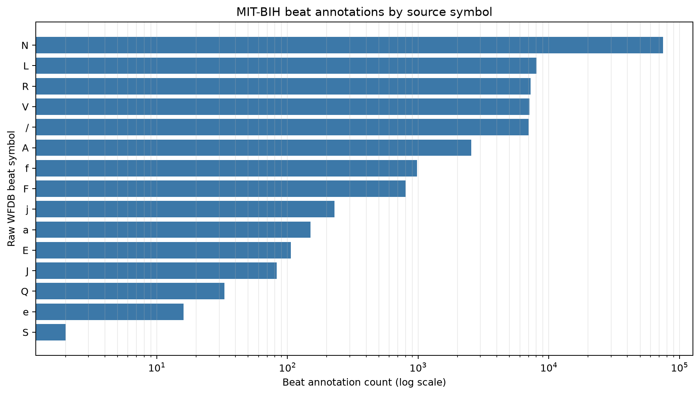
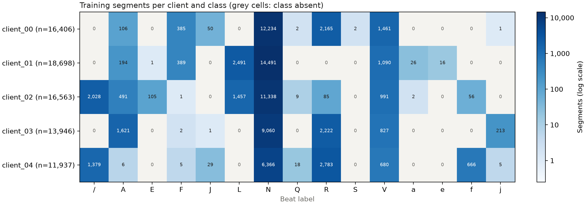
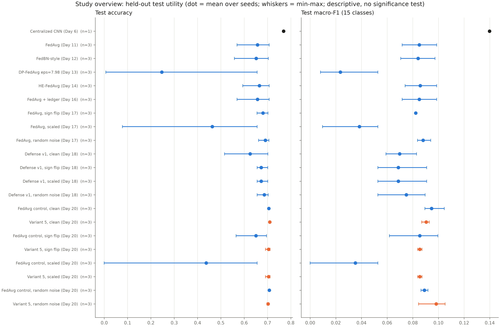
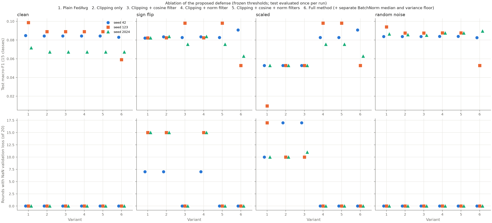
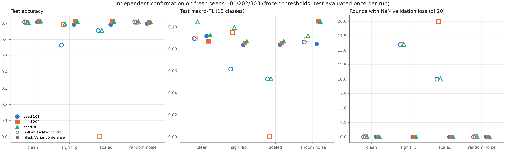
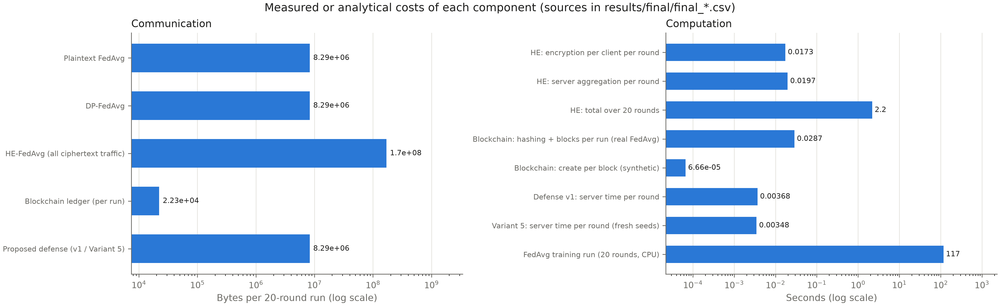

# Blockchain-Enabled Federated Learning for Privacy-Preserving Arrhythmia Detection

**A research prototype that measures what federated learning, differential privacy, homomorphic encryption, an audit ledger, and a robust aggregation defense each contribute, and cost, when training an ECG beat classifier on the MIT-BIH Arrhythmia Database.**

| | |
|---|---|
| **Status** | Research freeze, 2026-10-05. All planned experiments are complete; results are frozen. |
| **Scope** | A simulated 5-client federation on one public dataset (MIT-BIH v1.0.0), run on one CPU machine |
| **Evidence** | 26 research documents, each experiment's frozen configuration, 110 automated tests, and SHA-256 hashes of key artifacts |
| **Not shown** | Clinical usefulness, diagnostic validity, statistical significance, or generalization beyond MIT-BIH |

---

## Contents

1. [Research aim](#1-research-aim)
2. [What the study does](#2-what-the-study-does)
3. [The data and the core challenge](#3-the-data-and-the-core-challenge)
4. [Results](#4-results)
5. [What this study does not establish](#5-what-this-study-does-not-establish)
6. [Getting started](#6-getting-started)
7. [Repository guide](#7-repository-guide)
8. [Documentation index](#8-documentation-index)

---

## 1. Research aim

Hospitals hold ECG data that could train better arrhythmia detectors, but privacy, regulation and ownership often prevent them from pooling it. Federated learning lets institutions train a shared model without exchanging raw ECG records. FL alone does not guarantee privacy, trustworthy coordination, or resistance to malicious participants, so this project examines each additional safeguard separately.

**Research questions**

| | Question |
|---|---|
| **RQ1** | How accurately can deep learning detect arrhythmias from ECG, centrally and federated? |
| **RQ2** | How does federated learning compare with centralized training under heterogeneous (non-IID) data? |
| **RQ3** | What do differential privacy and homomorphic encryption cost in utility, computation and communication? |
| **RQ4** | Can a blockchain-style ledger make federated training verifiable and auditable? |
| **RQ5** | Can a proposed aggregation mechanism fix an identified weakness at acceptable cost? |

## 2. What the study does

Every component was tested as a **one-factor experiment**: one change at a time, against a matched baseline, with predeclared seeds, and with the test set evaluated once per run. The components were **not** combined into one integrated system.

```text
                 MIT-BIH (48 records) -> filter -> beat windows -> 15 beat classes
                                            |
                 47 subject groups -> train / validation / test split (no subject overlap)
                                            |
          +--------------------+------------+--------------+-----------------+
          |                    |                           |                 |
   Centralized CNN      FedAvg, 5 clients            One-factor variants of FedAvg
   (reference)          (whole training groups)      +-- FedBN-style local BatchNorm
                                                     +-- Differential privacy (client-level)
                                                     +-- Homomorphic encryption (CKKS)
                                                     +-- Audit ledger (hash chain)
                                                     +-- Malicious client (3 attacks)
                                                     +-- Proposed robust aggregation defense
```

| Component | Design in one line | Details |
|---|---|---|
| Data pipeline | 0.5–40 Hz band-pass, 216-sample beat windows, per-window z-score; 109,460 segments | [preprocessing](docs/preprocessing.md), [splits](docs/dataset_splits.md) |
| Centralized baseline | 1D CNN with 10,127 parameters, frozen as the reference | [baseline](docs/baseline_freeze.md) |
| Federated learning | FedAvg, 5 clients built from whole subject groups, 20 rounds | [FedAvg](docs/federated_learning_baseline.md), [robustness](docs/fedavg_robustness.md) |
| Differential privacy | Client-level DP-FedAvg with an exact Gaussian-DP accountant | [DP](docs/differential_privacy.md) |
| Homomorphic encryption | The server adds up CKKS-encrypted updates it cannot read (TenSEAL / SEAL, 128-bit) | [HE](docs/homomorphic_encryption.md) |
| Audit ledger | A SHA-256 hash chain recording every client and global model hash per round | [ledger](docs/blockchain.md), [integration](docs/blockchain_fl_integration.md) |
| Attacks | One malicious client: sign flip, ×10 boost, or noise | [attacks](docs/malicious_clients.md) |
| Proposed defense | Update clipping plus cosine and norm screening against a robust median reference | [method](docs/proposed_method.md), [ablation](docs/ablation.md) |

## 3. The data and the core challenge



*Figure 1. MIT-BIH beat annotations per class (log scale). Normal beats (`N`, 75,028) outnumber the rarest class (`S`, 2) by more than four orders of magnitude. Only 8 of the 15 classes appear in the held-out test set at all. This imbalance is why accuracy alone is misleading, and why this study reports macro-F1.*



*Figure 2. How training data falls across the 5 simulated clients when whole subject groups are assigned. Grey cells are classes a client never sees. Paced (`/`) and `L` beats exist in only 2 training records each, so no client split can share them more widely. This is the natural non-IID setting every federated experiment uses.*

## 4. Results

All numbers are held-out test results with each test set evaluated **once**, typically over 3 seeds. They are **descriptive**: no significance tests were run. The full tables are in [`docs/final_results.md`](docs/final_results.md) and [`results/final/`](results/final/).

### 4.1 Utility across every method



*Figure 3. Test accuracy and macro-F1 for every experiment (dot = mean over seeds; whiskers = min–max). The centralized CNN (black) sets the upper reference. Variant 5 of the proposed defense is in orange.*

| Setting | Accuracy | Macro-F1 | Reading |
|---|---:|---:|---|
| Centralized CNN | 0.769 | 0.140 | Reference. Weak on rare classes even here. |
| FedAvg (3 seeds) | 0.657 | 0.085 | All 37 clean federated runs fall below centralized; predictions collapse to mostly `N`/`V` |
| + Differential privacy (ε = 7.98) | 0.247 | 0.024 | Utility destroyed at this privacy level with 5 clients |
| + Homomorphic encryption | 0.665 | 0.086 | Utility preserved (aggregation error ≈ 10⁻⁷) |
| + Audit ledger | identical | identical | Recording does not change training (bit-identical) |

### 4.2 Robustness: what breaks FedAvg, and what fixes it



*Figure 4. Ablation of the defense. Variant 1 is plain FedAvg, variants 2–5 add components one at a time, and variant 6 is the full Day 18 method. The bottom row counts rounds in which the model produced invalid (NaN) outputs. A single malicious client breaks plain FedAvg under sign flip and ×10 scaling. The **cosine filter** stops the sign flip, and the **norm filter** stops the scaling. Clipping alone stops neither.*



*Figure 5. Independent confirmation on **fresh seeds** never used before (hollow = FedAvg, filled = Variant 5 defense, thresholds frozen in advance). Under attack, FedAvg breaks in 10–20 of 20 rounds. The defense keeps the model valid in every round, with no honest client wrongly flagged.*

| Fresh seeds 101 / 202 / 303 | FedAvg macro-F1 | Defense macro-F1 | Attacker detected | Honest clients flagged |
|---|---:|---:|---:|---:|
| No attack | 0.095 | 0.090 | — | 0% |
| Sign flip | 0.085 (model breaks after selection) | 0.085 (model stays valid) | 100% | 0% |
| ×10 scaling | 0.035 | 0.085 | 100% | 0% |
| Norm-matched noise | 0.089 | 0.098 | 5–10% | 0% |

### 4.3 Costs



*Figure 6. Communication and computation per component (log scales). Homomorphic encryption is the only component with a large communication cost (about 20.5× plaintext FedAvg). The ledger and the defense add negligible time and no extra communication.*

| Component | Communication | Computation |
|---|---|---|
| Differential privacy | +0 bytes | no material increase |
| Homomorphic encryption | about 20.5× (170 MB vs 8.3 MB per run) | about 2.2 s per run (about 2%) |
| Audit ledger | about 22 KB per run | about 0.03 s per run (about 0.025%) |
| Proposed defense | +0 bytes | about 3.5 ms per round |

### 4.4 Research questions at a glance

| | Status | One-line answer within this study's scope |
|---|---|---|
| RQ1 | Partially answered | The model detects common beats but not rare ones (macro-F1 0.14 centralized) |
| RQ2 | Partially answered | FedAvg trails centralized training under non-IID clients; the cause of the collapse is unresolved |
| RQ3 | Partially answered | HE preserves utility at about 20× communication; client-level DP at ε = 7.98 destroys it |
| RQ4 | Partially answered | The ledger makes training verifiable and tamper-evident with an external anchor; it is not a distributed blockchain |
| RQ5 | Partially answered | The defense neutralises two attack types at negligible cost; tested against one non-adaptive attacker only |

## 5. What this study does not establish

This project is an **experimentally complete prototype evaluation**, not a finished answer to its research questions. Before relying on or extending it, note:

- **No literature review is documented yet.** [`docs/literature_matrix.md`](docs/literature_matrix.md) is an empty template, so the proposed defense is not positioned against prior work. No novelty or superiority is claimed.
- **The classification task itself is weak.** Macro-F1 is 0.14, the label taxonomy is provisional, and only 8 of 15 classes have test examples.
- **Components were tested separately.** DP, HE, the ledger and the defense were never combined into the full framework.
- **Coverage gaps:**
  - privacy was tested at a single ε, with no record-level DP;
  - the ledger runs on a single node, with no consensus or signatures;
  - there is no local-only baseline;
  - only 3 + 3 seeds were run.

All 38 recorded limitations are in [`docs/final_limitations.md`](docs/final_limitations.md).

## 6. Getting started

### Requirements

- **Python 3.12 (64-bit).** The pinned TenSEAL version ships prebuilt wheels for 3.12.
- **About 1.5 GB of disk** for the environment, plus the dataset.
- **CPU only.** No GPU is needed.

### Setup

```powershell
# Windows (PowerShell)
python -m venv .venv
.\.venv\Scripts\Activate.ps1
python -m pip install -r requirements.txt
python -m unittest discover -s tests        # expect: Ran 110 tests ... OK
```

```bash
# Linux / macOS
python3.12 -m venv .venv && source .venv/bin/activate
pip install torch==2.14.1 --index-url https://download.pytorch.org/whl/cpu   # CPU build, as used here
pip install -r requirements.txt
python -m unittest discover -s tests
```

`requirements.txt` was verified by building a **fresh** environment from it alone. In that environment all 110 tests passed, and it reproduced the official FedAvg model bit for bit.

> **If you received this project as a folder,** do not reuse the included `.venv/`: it is tied to the original machine. Delete it and create a new one with the steps above.

### Data

The MIT-BIH data is **not part of the Git repository**. It is publicly available from [PhysioNet](https://physionet.org/content/mitdb/1.0.0/). Place it in `data/raw/mitbih/`, then follow the preprocessing and split steps in [`docs/reproducibility.md`](docs/reproducibility.md). That guide also gives every experiment's command, seed and expected hash.

### Quick look without retraining

The frozen results are already in the repository: `results/final/` holds the summary tables, `docs/final_results.md` the narrative, and `notebooks/` the walkthroughs. A single 20-round FedAvg run takes about 2 minutes on a modern CPU.

## 7. Repository guide

| Path | Contents |
|---|---|
| `src/preprocessing/` | ECG loading, filtering, segmentation, normalisation, splitting, validation |
| `src/models/` | 1D CNN, centralized training and evaluation |
| `src/federated/` | FedAvg, client partitioning, DP (`privacy.py`), attacks, the proposed defense (`proposed_defense.py`), ablation and final validation |
| `src/he/` | CKKS encryption and encrypted aggregation |
| `src/blockchain/` | Hash-chained ledger, tamper tests, benchmarks, FedAvg recorder |
| `src/final_report.py` | Builds the consolidated tables and figures in `results/final/` |
| `configs/` | Frozen configuration for every experiment |
| `results/` | Per-experiment metrics, tables and figures; the consolidated summary is in `results/final/` |
| `docs/` | One document per experiment, plus the final results, methodology, limitations and reproducibility |
| `tests/` | 110 unit and integration tests |
| `notebooks/` | Dataset exploration, preprocessing checks, training and evaluation walkthroughs |

`experiments/`, `src/privacy/` and `src/algorithms/` are empty placeholders from the original project layout; the code they were meant for is in the modules above. Model checkpoints and per-run prediction files can be regenerated and are not tracked in Git, except for the official centralized and FedAvg baselines.

## 8. Documentation index

| Read this | For |
|---|---|
| [`docs/final_results.md`](docs/final_results.md) | All results, research-question evidence, open issues |
| [`docs/final_methodology.md`](docs/final_methodology.md) | The complete pipeline and every design decision |
| [`docs/final_limitations.md`](docs/final_limitations.md) | All 38 known limitations |
| [`docs/reproducibility.md`](docs/reproducibility.md) | Environment, commands, seeds, hashes |
| [`docs/research_log.md`](docs/research_log.md) | Day-by-day record of the study |
| [`docs/dataset_mitbih.md`](docs/dataset_mitbih.md), [`docs/label_taxonomy_audit.md`](docs/label_taxonomy_audit.md), [`docs/patient_mapping_audit.md`](docs/patient_mapping_audit.md) | Dataset exploration and audits |

**Research practice followed throughout:**
- Every number comes from a saved experiment output, and nothing is fabricated.
- Test sets were evaluated once and never used for tuning.
- Defense thresholds were fixed on a separate calibration seed.
- Claims are limited to what was measured.
